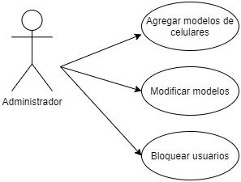
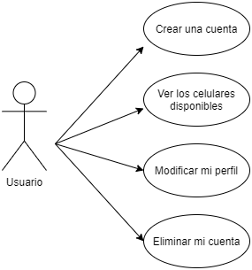
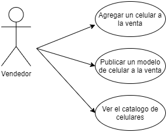

# CelulApp
# Api para celulares E-Commerce

## 📱 Link de API Celulapp: [https://celulapp.herokuapp.com/v1](https://celulapp.herokuapp.com/v1)

## 📃 Documentación de API Celulapp (Swagger): [https://celulapp.herokuapp.com/api-docs/](https://celulapp.herokuapp.com/api-docs/)

## 📷 Funcionamiento de la API Celulapp: [Video](https://www.canva.com/design/DAEq8D8X8ls/PqPdmG1D-MajAuxBoe5mQw/watch?utm_content=DAEq8D8X8ls&utm_campaign=designshare&utm_medium=link&utm_source=publishsharelink)

Api para alta, baja y cambio de catálogos de celulares.
La api cuenta con todos los métodos disponibles para ser utilizada desde una web app o app movil.
## Integrantes del equipo 11

- María Fernanda Orozco Castro [@Orozcastro](https://www.github.com/Orozcastro)

- Luis Daniel Ramirez Guerra [@DanyGuerra](https://www.github.com/DanyGuerra)

- Luis Felipe Carillo Alvarado [@carrillodev](https://www.github.com/carrillodev)

- Victor Alberto Díaz Sánchez [@vads26](https://www.github.com/vads26)

  # 🚀 api

[]()
## Instalación

Instalación del proyecto con npm

```bash
    npm install --save
```

Ejecutar proyecto con npm

```bash
    npm run start
```
## Entidades API

#### Usuarios

| Campo | Tipo     | Descripción                |
| :-------- | :------- | :------------------------- |
| `id` | `int` | Identificar de usuario |
| `username` | `string` | Usuario de acceso |
| `nombre` | `string` | Nombre de usuario |
| `apellido` | `string` | Apellido de usuario |
| `email` | `string` | Correo electrónico |
| `password` | `string` | Contraseña de acceso |
| `tipo` | `string` | Tipo de perfil: Administrador, Comprador y Ventas |
| `status` | `boolean` | Alta o baja de usuario |

#### Celulares

| Campo | Tipo     | Descripción                |
| :-------- | :------- | :------------------------- |
| `id` | `int` | Identificar del celular |
| `marca` | `string` | Marca del celular |
| `modelo` | `string` | Modelo del celular |
| `sistemaOperativo` | `string` | Sistema operativo instalado |
| `ram` | `string` | Memoria RAM |
| `almacenamiento` | `string` | Capacidad de Almacenamiento |
| `color` | `string` | Color del celular |


## Referencias API

#### Obtener todos los usuarios

```http
  GET /v1/usuarios/ObtenerUsuarios
```

#### Crear usuario

```http
  POST /v1/usuarios/crearUsuario

  BODY {
        "id": 1,
        "username": "XXX",
        "nombre": "XXX",
        "apellido": "xxx",
        "email": "XX@XX.COM",
        "password": "XXXX",
        "tipo": "Administrador",
        "status": "1"
    }
```

#### Modificar usuario

```http
  PUT /v1/usuarios/modificarUsuario${id}

  BODY {
        "username": "XXX",
        "nombre": "XXX",
        "apellido": "xxx",
        "email": "XX@XX.COM",
        "password": "XXXX",
        "tipo": "Administrador",
        "status": "1"
    }
```

#### Eliminar usuario

```http
  DELETE /v1/usuarios/eliminarUsuario${id}

  BODY {
        "username": "XXX",
        "nombre": "XXX",
        "apellido": "xxx",
        "email": "XX@XX.COM",
        "password": "XXXX",
        "tipo": "Administrador",
        "status": "1"
    }
```

#### Obtener todos los celulares

```http
  GET /v1/celulares/obtenerCelulares
```

#### Crear celular

```http
  POST /v1/celulares/crearCelular

  BODY {
        "id": 1,
        "marca": "XXX",
        "modelo": "XXX",
        "sistemaOperativo": "xxx",
        "ram": "6GB",
        "almacenamiento": "XXXX",
        "tipo": "Administrador",
        "color": "Rojo"
    }
```

#### Modificar celular

```http
  PUT /v1/usuarios/modificarCelular${id}

  BODY {
        "marca": "XXX",
        "modelo": "XXX",
        "sistemaOperativo": "xxx",
        "ram": "6GB",
        "almacenamiento": "XXXX",
        "tipo": "Administrador",
        "color": "Rojo"
    }
```

#### Eliminar celular

```http
  DELETE /v1/usuarios/eliminarCelular${id}

  BODY {
        "marca": "XXX",
        "modelo": "XXX",
        "sistemaOperativo": "xxx",
        "ram": "6GB",
        "almacenamiento": "XXXX",
        "tipo": "Administrador",
        "color": "Rojo"
    }
```

## Descripción

## Estructura del proyecto

### Historias de usuario

#### Administrador
- Como administrador de CelulApp quiero agregar nuevos modelos de celulares al catalogo
- Como administrador de celulAPP quiero quiero modificar los modelos del catálogo
- Como administrador quiero bloquear usuarios.


#### Usuario
- Como usuario de CelulApp quiero registrar una nueva cuenta de usuario para tener acceso a la plataforma
- Como usuario de CelulApp quiero ver todos los celulares disponibles y hacer filtros de busquedas
- Como usuario de CelulApp quiero eliminar mi propia cuenta si así lo deseo
- Como usuario de CelulApp quiero modificar mi perfil de usuario si así lo deseo

#### Vendedor
- Como vendedor de CelulApp quiero poner a la venta nuevos modelos de celulares en el catalogo
- Como vendedor de celulAPP quiero publicar anuncios de celulares para poder venderlos
- Como vendedor de celulAPP quiero ver todo el catálogo de celulares y poder filtrar por categorías, precios, modelos y marcas


### Diagramas caso de uso







## Tecnologías utilizadas

Para la creación de la API se utilizan las siguientes tecnologías

- [Node.js](https://nodejs.org/es/): Ideado como un entorno de ejecución de JavaScript orientado a eventos asíncronos, Node.js está diseñado para crear aplicaciones network escalables.

- [npm](https://www.npmjs.com/): es el administrador de paquetes para Node.js.

- [Express](http://expressjs.com/): con una gran variedad de métodos HTTP y middleware a disposición, para crear una API robusta rápido y fácil.

- [nodemon](https://www.npmjs.com/package/nodemon): herramienta que ayuda a desarrollar aplicaciones basadas en node.js al reiniciar automáticamente la aplicación de node cuando se detectan cambios de archivo en el directorio.

La forma de correr el proyecto es ejecutando el siguiente comando **`npm run start`**

## Deploy de la API

Una vez que la API está terminada es necesario el deploy de esta. Este proceso se requiere para que cualquier persona pueda utilizar los servicios de nuestra API.

Para hacer deploy de nuestra API utilizaremos la plataforma de [Heroku](https://www.heroku.com/). Esta plataforma nos permite probar aplicaciones de una manera rápida.

**Link de la API celulapp:** [https://celulapp.herokuapp.com/v1](https://celulapp.herokuapp.com/v1)
